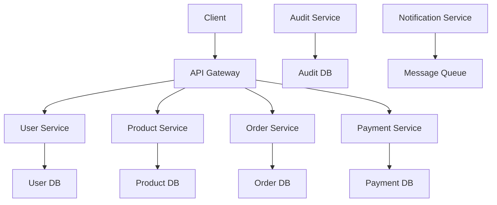

# FarmConnect - Secure Microservices Architecture

## 🏗️ Architecture Overview

**Architecture Type**: **Microservices with ISO/IEC 27001/27002 Compliance**

### Core Services
1. **User Service** - Authentication, authorization, user management
2. **Product Service** - Product catalog, inventory management
3. **Order Service** - Order processing, workflow management
4. **Payment Service** - Payment processing, financial transactions
5. **Notification Service** - Email, SMS, push notifications
6. **Audit Service** - Compliance logging, security monitoring

### Infrastructure Components
- **API Gateway** (Kong) - Request routing, rate limiting, security
- **Service Discovery** - Automatic service registration and discovery
- **Load Balancer** - Traffic distribution and failover
- **Message Queue** (Redis) - Asynchronous communication
- **Monitoring Stack** - Prometheus, Grafana, ELK Stack
- **Secrets Management** (Vault) - Secure credential storage

## 🛡️ ISO/IEC 27001/27002 Compliance Features

### A.12 Operations Security
- **A.12.4.1 Event Logging**: Comprehensive audit logging across all services
- **A.12.4.2 Log Information Protection**: Encrypted log storage with integrity checks
- **A.12.4.3 Administrator Logs**: Separate admin activity logging
- **A.12.4.4 Clock Synchronization**: NTP synchronization across all services

### A.13 Communications Security
- **A.13.1.1 Network Controls**: Network segmentation and firewall rules
- **A.13.1.2 Security of Network Services**: Secure service-to-service communication
- **A.13.2.1 Information Transfer Policies**: Encrypted data transmission (TLS 1.3)

### A.14 System Acquisition, Development and Maintenance
- **A.14.2.1 Secure Development Policy**: Security-first development practices
- **A.14.2.5 Secure System Engineering**: Security by design principles
- **A.14.2.8 System Security Testing**: Automated security testing

### A.18 Compliance
- **A.18.1.1 Applicable Legislation**: GDPR, CCPA compliance
- **A.18.1.4 Privacy and PII Protection**: Data encryption and anonymization
- **A.18.2.2 Compliance Reviews**: Regular security audits

## 🔐 Security Implementation

### Authentication & Authorization
```typescript
// JWT with short expiration and refresh tokens
const tokenConfig = {
  accessTokenExpiry: '15m',
  refreshTokenExpiry: '7d',
  algorithm: 'RS256',
  issuer: 'farmconnect.com',
  audience: 'farmconnect-api'
};

// Multi-factor authentication
const mfaConfig = {
  enabled: true,
  methods: ['totp', 'sms'],
  backupCodes: 10
};
```

### Data Encryption
```typescript
// Encryption at rest and in transit
const encryptionConfig = {
  algorithm: 'AES-256-GCM',
  keyRotation: '90d',
  tlsVersion: '1.3',
  certificateValidation: true
};
```

### Rate Limiting & DDoS Protection
```typescript
const rateLimitConfig = {
  windowMs: 15 * 60 * 1000, // 15 minutes
  max: 100, // requests per window
  skipSuccessfulRequests: false,
  skipFailedRequests: false
};
```

## 📊 Monitoring & Compliance

### Audit Logging
- **User Actions**: All user interactions logged with timestamps
- **System Events**: Service starts, stops, errors, security events
- **Data Access**: All database queries and data modifications
- **Admin Activities**: Privileged operations with approval workflows

### Metrics Collection
- **Performance Metrics**: Response times, throughput, error rates
- **Security Metrics**: Failed login attempts, suspicious activities
- **Business Metrics**: User registrations, orders, revenue
- **Infrastructure Metrics**: CPU, memory, disk, network usage

### Alerting
- **Security Alerts**: Intrusion attempts, data breaches, anomalies
- **Performance Alerts**: High response times, service failures
- **Business Alerts**: Payment failures, order processing issues

## 🚀 Deployment Strategy

### Container Orchestration
```yaml
# Kubernetes deployment with security policies
apiVersion: apps/v1
kind: Deployment
metadata:
  name: user-service
spec:
  replicas: 3
  template:
    spec:
      securityContext:
        runAsNonRoot: true
        runAsUser: 1001
        fsGroup: 1001
      containers:
      - name: user-service
        image: farmconnect/user-service:latest
        securityContext:
          allowPrivilegeEscalation: false
          readOnlyRootFilesystem: true
          capabilities:
            drop:
            - ALL
```

### Network Security
```yaml
# Network policies for service isolation
apiVersion: networking.k8s.io/v1
kind: NetworkPolicy
metadata:
  name: user-service-policy
spec:
  podSelector:
    matchLabels:
      app: user-service
  policyTypes:
  - Ingress
  - Egress
  ingress:
  - from:
    - podSelector:
        matchLabels:
          app: api-gateway
    ports:
    - protocol: TCP
      port: 3001
```

## 🔄 Data Flow & Communication

### Service Communication


### Event-Driven Architecture
```typescript
// Event publishing
interface OrderCreatedEvent {
  orderId: string;
  userId: string;
  farmerId: string;
  items: OrderItem[];
  total: number;
  timestamp: Date;
}

// Event handling
class PaymentService {
  @EventHandler('order.created')
  async handleOrderCreated(event: OrderCreatedEvent) {
    await this.createPaymentIntent(event);
  }
}
```

## 📋 Compliance Checklist

### ISO 27001 Requirements
- [x] Information Security Policy
- [x] Risk Assessment and Treatment
- [x] Security Awareness Training
- [x] Access Control Management
- [x] Cryptography Controls
- [x] Physical Security
- [x] Operations Security
- [x] Communications Security
- [x] System Development Security
- [x] Supplier Relationships
- [x] Incident Management
- [x] Business Continuity
- [x] Compliance Monitoring

### GDPR Compliance
- [x] Data Protection by Design
- [x] Consent Management
- [x] Right to be Forgotten
- [x] Data Portability
- [x] Breach Notification
- [x] Privacy Impact Assessment
- [x] Data Protection Officer

## 🛠️ Development Workflow

### Security Testing
```bash
# Static code analysis
npm run security:scan

# Dependency vulnerability check
npm audit --audit-level high

# Container security scan
docker scan farmconnect/user-service:latest

# Infrastructure security test
terraform plan -var-file=security.tfvars
```

### Continuous Integration
```yaml
# GitHub Actions security pipeline
name: Security Pipeline
on: [push, pull_request]
jobs:
  security:
    runs-on: ubuntu-latest
    steps:
    - uses: actions/checkout@v3
    - name: Run security tests
      run: |
        npm run security:scan
        npm audit --audit-level high
        docker run --rm -v $PWD:/app securecodewarrior/docker-security-scan
```

## 📈 Scalability & Performance

### Horizontal Scaling
- **Auto-scaling**: Based on CPU, memory, and request metrics
- **Load Balancing**: Round-robin with health checks
- **Database Sharding**: Horizontal partitioning by tenant
- **Caching Strategy**: Redis for session and application data

### Performance Optimization
- **Connection Pooling**: Database connection management
- **Query Optimization**: Indexed queries and query analysis
- **CDN Integration**: Static asset delivery
- **Compression**: Gzip/Brotli response compression

## 🔧 Maintenance & Operations

### Backup Strategy
- **Database Backups**: Daily automated backups with 30-day retention
- **Configuration Backups**: Version-controlled infrastructure as code
- **Log Archival**: Long-term storage for compliance (7 years)

### Disaster Recovery
- **RTO**: 4 hours (Recovery Time Objective)
- **RPO**: 1 hour (Recovery Point Objective)
- **Multi-region**: Active-passive deployment
- **Failover**: Automated with health checks

This microservices architecture provides enterprise-grade security, compliance, and scalability while maintaining the flexibility to evolve individual services independently.